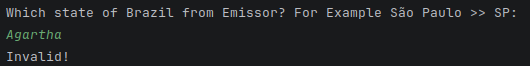
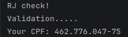

# Brazilian CPF Generator

A simple and functional Brazilian CPF (Cadastro de Pessoas Físicas) generator built in Python.

This project generates **valid** CPF numbers according to the official rules of the Brazilian Federal Revenue Service, including both check digits.

# Features
- Generates valid random CPF numbers
- Allows choosing the issuing state (region code - 9th digit)
- Simple terminal interface
- Object-Oriented Programming structure
# Technologies
- Python 3

# Demo
**Type input**
- 
- 

**Input invalid!? No worries!**

-

- 
- 